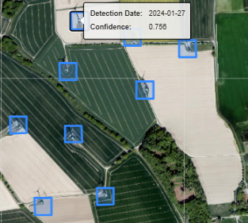

# Description

Detects wind turbines in open landscapes using Sentinel-2 imagery and a pre-trained computer vision object detection model.
Open landscapes can be considered all landscapes outside of built-up urban and peri-urban areas together with forested areas. 
In general open landscapes is mainly comprised of open agricultural land and nature areas. 

The user selects a region of interest and specifies a year to analyze. 
The best available Sentinel-2 imagery for the selected region is ranked based on quality metrics and
the highest ranked image is chosen for wind turbine detection, based on several ranking parameters. 
The Sentinel-2 imagery is then passed to the pre-trained neural network that returns the bounding boxes 
for each detected turbine. Wind turbines are reported with a detection probability on the scale
of 0 - 1. The higher the probability of the detection, the higher confidence that it is a TRUE detection.

Additional filtering is applied to account for multiple detections in close proximity. 
The end result includes a .geojson file defining the bounding box of all wind turbine detections 
with the detection date and probability as attributes. The service is so far applicable
to Central Europe, with plans to expand further. 

# Performance characteristics

...

# Examples

Below we overlay a Sentinel2-RGB image with the ML classification, thereby highlighting the detected areas.

# Literature references

...

# Known limitations

Works in open landscapes only, see description.

