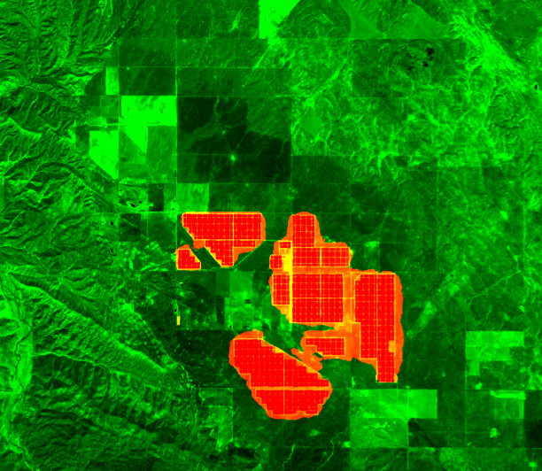

# Description

Mapping solar photovoltaic (PV) installations from space is a key input for renewable-energy
monitoring, grid planning and climate policy. This service detects ground-mounted and rooftop
solar PV panels from Sentinel-2 L1C imagery using a deep-learning segmentation model deployed
through an openEO User-Defined Process (UDP).

The processing pipeline is fully encapsulated in a single `apply_neighborhood` UDF and consists
of three stages that run per 256 x 256 px chunk:

1. **Cloud-free SLIC temporal mosaic** of the multi-temporal Sentinel-2 L1C stack, using the
   Sentinel-2 L2A Scene Classification Layer (SCL) for cloud masking. This mirrors the SNIC
   pipeline used to build the training chips.
2. **Training-aligned percentile normalisation** of the 13-band composite using band statistics
   shipped together with the model.
3. **ONNX U-Net inference** (fixed 256 x 256 x 13 input) producing per-pixel solar PV
   probabilities.

The model and ONNX runtime are loaded from openEO `udf-dependency-archives`.

## Inputs

- `spatial_extent`: bounding box (`west`, `south`, `east`, `north`) of the area of interest.
- `temporal_extent`: ISO-8601 date range `[start, end]` used to build the cloud-free mosaic.

## Outputs

A 2-band raster:

- `solar_pv` (uint8) - binary detection mask (1 = solar PV pixel).
- `solar_pv_probability` (float32) - per-pixel model probability.

# Examples

# Known limitations

- The model was trained on Sentinel-2 L1C imagery at 10 m resolution. Areas outside the
  training distribution (e.g. very small rooftop installations or unusual landscapes) may
  show reduced accuracy.
- Inference is sensitive to the quality of the cloud-free mosaic. Very cloudy temporal
  windows or short time ranges with few clear acquisitions can degrade results.
- The UDF depends on external archives (`onnx_deps_python311.zip` and `solar_pv_rui.zip`)
  hosted on the CloudFerro S3 endpoint. Availability of these archives is required for
  the service to run.

# References

- Source repository: https://github.com/ray-climate/solar_openEO
- UDP definition: https://raw.githubusercontent.com/ray-climate/solar_openEO/c4f1b0c7ba6ab9acf2b11cc999c05e6346b6bf21/openeo_udp/process_graph/solar_pv_detection_udp.json
