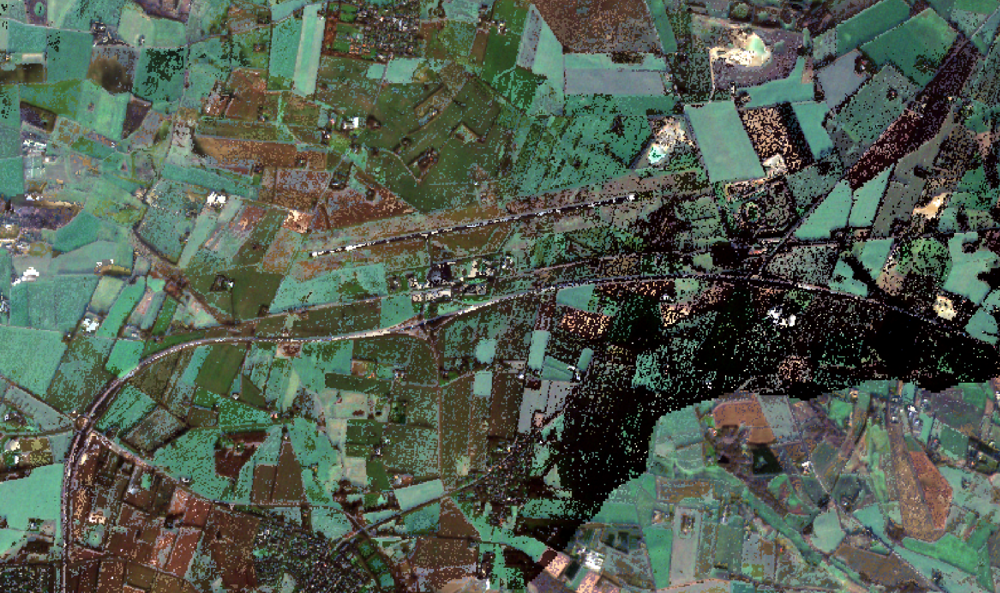

# Description

This algorithm generates a Sentinel-2 based composite for a selected area and temporal extent. By default, the resolution of the output is 10 meters.

The used compositing method is the "max-NDVI" method, which selects the pixel with the highest NDVI value for each pixel location and time window.
The method falls under the 'rank composite' category, and ensures that selected spectral band values for any pixel all come from the same observation.

The method generates good results for timeseries analytics, but spatially neighbouring pixels may be selected from different observations,
which leads to visual discontinuities in the result.

# Performance characteristics

The method is computationally efficient, as it only requires the B04, B08 and SCL bands to determine the rank score. Loading 
of other bands can be minimized to read only selected observations.


# Examples

The image below shows a typical result over an agricultural area.


A complete example including STAC metadata is shown here:

https://radiantearth.github.io/stac-browser/#/external/s3.waw3-1.cloudferro.com/swift/v1/APEx-examples/max_ndvi_denmark/collection.json

The processing platform reported these usage statistics for the example:

```
Credits: 63 
CPU usage: 47.743,722 cpu-seconds
Wall time: 1.948 seconds
Input Pixel 10.997,635 mega-pixel
Max Executor Memory: 3,239 gb
Memory usage: 154.767.121,977 mb-seconds
Network Received: 1.677.537.930.040 b
```

The relative cost is 1 platform credits per km² for a 3 month input window.
The cost per input pixel is 0.0057 credits per megapixel.

# Literature references

The max-ndvi compositing method has been applied to multiple sensors, as described in literature:

This publication describes characteristics of the method when applied to AVHRR data:
https://www.tandfonline.com/doi/abs/10.1080/01431168608948945

This publication applied it to Landsat data, for cropland estimation:
https://www.nature.com/articles/s43016-021-00429-z

# Known limitations

The method uses a vegetation index as scoring metric to determine the best pixel, making it only suitable for land applications. 
Bare or urban areas may not be well represented in the composite. 

It favours the observation which is least contaminated by atmospheric effects, but does not guarantee a fully uncontaminated composite.

For individual time windows, the method was efficient up to 100x100km areas. For larger areas of interest, we recommend splitting the area into smaller tiles.


# Known artifacts

Artifacts are expected over water and urban areas.


Residual cloud artifacts may be present in the composite, especially for smaller time windows or during cloudy seasons.
The cloud artifacts are caused by the limited capabilities of the default Sentinel-2 cloud detection mechanism to correctly identify all clouds.

