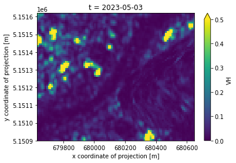
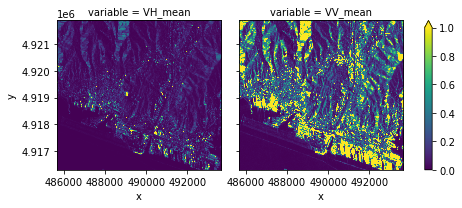

# Description

This algorithm derive statistical insights a Sentinel-1 GRD collection for a selected area and temporal extent. 
It computes statistical metrics (e.g., mean, minimum, and maximum backscatter) by using the openEO processes.

Overall, the workflow is cloud-based geospatial processing services to extract useful statistics from large Earth observation datasets efficiently.

# Performance characteristics

The process is implemented in Python and uses the openEO Python client to interact with the openEO backend.
The process uses both the "VH", "VV" polarization bands to compute the statistical metrics. In the workflow, `sigma0-ellipsoid` has been applied to the raw sar data to quantify the backscatter intensity. 

# Examples

The image below shows a Raw Sentinel 1 GRD data for a selected region.

Similarly, the image below shows the statistical insights derived from the Sentinel 1 GRD data.

For a slightly larger extent:

