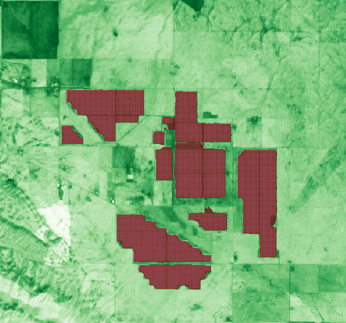

# Description

Mapping solar photovoltaic (PV) installations from space is a key input for renewable-energy
monitoring, grid planning and climate policy. This service detects ground-mounted and rooftop
solar PV panels from Sentinel-2 L1C imagery using a deep-learning segmentation model deployed
through an openEO User-Defined Process (UDP).

The processing pipeline is fully encapsulated in a single `apply_neighborhood` UDF and consists
of three stages that run per 256 x 256 px chunk:

1. **Cloud-free SLIC temporal mosaic** of the multi-temporal Sentinel-2 L1C stack, using the
   Sentinel-2 L2A Scene Classification Layer (SCL) for cloud masking. This mirrors the SNIC
   pipeline used to build the training chips.
2. **Training-aligned z-score normalisation** of the 13-band composite using per-band mean and
   standard deviation statistics shipped together with the model (`band_stats.npz`).
   The formula applied is: $x' = (x - \mu) / \sigma$ per band.
3. **ONNX U-Net inference** (fixed 256 x 256 x 13 input) producing per-pixel solar PV
   probabilities.

The model and ONNX runtime are loaded from openEO `udf-dependency-archives`.

## Inputs

- `spatial_extent`: bounding box (`west`, `south`, `east`, `north`) of the area of interest.
- `temporal_extent`: time window as [`start_date`, `end_date`] (ISO-8601, `YYYY-MM-DD`) used to build the cloud-free mosaic.
  For summer or predominantly clear-sky periods, use a **3-month window** (for example `2024-06-30` to `2024-09-30`).
  For winter or persistently cloudy periods, use a **6-month window** to increase the chance of enough clear observations.

## Outputs

A 2-band raster:

- `solar_pv` (uint8) - binary detection mask (1 = solar PV pixel).
- `solar_pv_probability` (float32) - per-pixel model probability.

# Examples

# Known limitations

- The model was trained on Sentinel-2 L1C imagery at 10 m resolution. Areas outside the
  training distribution (e.g. very small rooftop installations or unusual landscapes) may
  show reduced accuracy.
- Inference is sensitive to the quality of the cloud-free mosaic. Very cloudy temporal
  windows or short time ranges with few clear acquisitions can degrade results.
- The UDF depends on external archives (`onnx_deps_python311.zip` and `openeo_dependencies.zip`)
  hosted on CloudFerro S3 and GitHub Releases respectively. Availability of these archives is required for
  the service to run.
- The ONNX model (`solar_pv.onnx`) and per-band statistics (`band_stats.npz`) are bundled inside
  `openeo_dependencies.zip`, published as part of the [v2.0.0 release](https://github.com/ray-climate/solar_openEO/releases/tag/v2.0.0)
  of the algorithm's source repository.

# References

- Source repository: https://github.com/ray-climate/solar_openEO
- UDP definition: https://raw.githubusercontent.com/ray-climate/solar_openEO/4aff50b20deae00834d0046f11ad6849e8e3d545/openeo_udp/process_graph/solar_pv_detection_udp.json
- ONNX model release (v2.0.0): https://github.com/ray-climate/solar_openEO/releases/tag/v2.0.0
