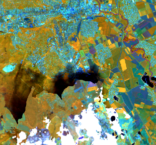

# Description

This algorithm generates a Sentinel-2 based composite for a selected area and temporal extent. By default, the resolution of the output is 20 meters.

The used compositing method is the "Best-Available-Pixel (BAP)" method, which selects the pixel with the highest BAP Score for each pixel location and within the time window. The method falls under the 'rank composite' category, and ensures that selected spectral band values for any individual pixel all come from the same observation.

The nature of the pixel selection - i.e. only choose the best pixel within each time window - guarantees that each pixel in the final composite is an actual observed value, rather than a statistical aggregation of multiple observations within the time window.

The BAP score is a weighted average of three scores:

- **Distance-to-Cloud Score**: Pixels that are clouds are given score 0. Pixels that are more than 150 pixels - calculated with the Manhattan distance measure, assuming a resolution of 20m - away from a cloud pixel are given score 1. The pixels in between are given a score versus distance-to-cloud that follows a Gaussian shape.
- **Coverage Score**: Per date, the percentage of all pixels that are classified as a cloud over the entire spatial extent is calculated. The Coverage Score is then equal to 1 - the cloud percentage.
- **Date Score**: In order to favor pixels that are observed in the middle of a month, a date score is calculated, which follows a Gaussian shape. I.e. the largest scores are given for days in the middle of the month, the lowest scores are given for days at the beginning and end of the month. 

The final BAP score is a weighted average of the three aforementioned scores. The weights are 1, 0.5 and 0.1 for the Distance-to-Cloud, Coverage and Date Score respectively.


# Performance characteristics

The method is computationally efficient, as it only requires the SCL band to determine the rank score. Loading of other bands can be minimized to read only selected observations.


# Examples

## 1-month composite over Denmark

A complete example of creating a monthly BAP composite over a time window of one month, including STAC metadata is shown here:

https://s3.waw3-1.cloudferro.com/swift/v1/APEx-examples/bap_composite_denmark/collection.json

Three bands were extracted over an area of ca. 60 km².

The processing platform reported these usage statistics for the example:

```
Credits: 14 
CPU usage: 7,214.715 cpu-seconds
Wall time: 577 seconds
Input Pixel 641.575 mega-pixel
Max Executor Memory: 3.262 gb
Memory usage: 25,839,702.134 mb-seconds
Network Received: 71,733,702,645 b
```

The relative cost is 0.2 CDSE platform credits per km² for a 1 month input window for three bands.
The cost per input pixel is 0.022 credits per megapixel.

## 12-month composite over Denmark

In a second example, a longer time window was tested, generating 12 3-band results. Here we see a lower cost per km², but a similar cost per input
pixel.

```
Credits: 88
CPU usage: 54,250.901 cpu-seconds
Wall time: 3,321 seconds
Input Pixel: 5,784.704 mega-pixel
Max Executor Memory: 4.401 gb
Memory usage: 231,391,081.839 mb-seconds
Network Received: 761,633,043,483 b
```

The relative cost is 0.12 CDSE platform credits per km² for a 12 month input window.
The cost per input pixel is 0.015 credits per megapixel.

# Literature references

The approach described here was originally applied to Landsat, and adapted here for Sentinel-2. 

#### BAP composites assessment

Francini, S., Hermosilla, T., Coops, N. C., Wulder, M. A., White, J. C., & Chirici, G. (2023). An assessment approach for pixel-based image composites. ISPRS Journal of Photogrammetry and Remote Sensing, 202, 1–12, [doi:10.1016/j.isprsjprs.2023.06.002](https://doi.org/10.1016/j.isprsjprs.2023.06.002)

#### BAP process background:

White, J.C.; Wulder, M.A.; Hobart, G.W.; Luther, J.E.; Hermosilla, T.; Griffiths, P.; Coops, N.C.; Hall, R.J.; Hostert, P.; Dyk, A.; et al. Pixel-based image compositing for large-area dense time series applications and science. Can. J. Remote Sens. 2014, 40, 192–212, [doi:10.1080/07038992.2014.945827](https://doi.org/10.1080/07038992.2014.945827).

# Known limitations

- Due to the nature of the OpenEO implementation of this algorithm, the spatial extent has to be in inline GeoJSON format. 
- The BAP score is fully dependent on the quality of the SCL band. Wrongly classified pixels may therefore receive a higher score than expected.
- The method is efficient up to 50x50km areas. For larger areas of interest, we recommend splitting the area into smaller tiles.
<!-- For different areas of interest, the user may need to tweak the relative weights of the three scores in BAP. This tweaking can be a lengthy procedure that is largely based on trial-and-error. Currently not applicable as the weights are not parametrized in the first version. -->

# Known artifacts

Residual cloud artifacts may be present in the composite, especially for smaller time windows or during cloudy seasons. The cloud artifacts are caused by the limited capabilities of the default Sentinel-2 cloud detection mechanism to correctly identify all clouds. 
The picture below shows a composite image with some cloud shadow pixels remaining. Because these pixels were not classified as cloud shadow in the SCL band, they are not masked out in the final composite.  

