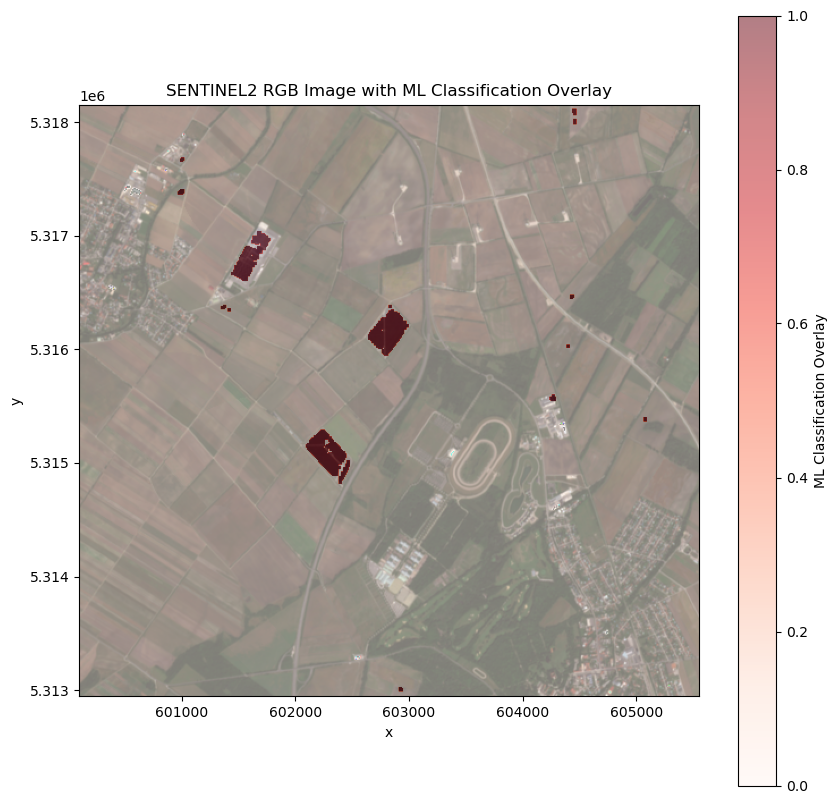

# Description

Photovoltaic farms (PV farms) mapping is essential for establishing valid policies regarding natural resources management and clean energy. As evidenced by the recent COP28 summit, where almost 120 global leaders pledged to triple the world’s renewable energy capacity before 2030, it is crucial to make these mapping efforts scalable and reproducible. Recently, there were efforts towards the global mapping of PV farms [1], but these were limited to fixed time periods of the analyzed satellite imagery and not openly reproducible. 

To resolve this limitation we implemented the detection workflow for mapping solar farms using Sentinel-2 imagery in an openEO process [1].

Open-source data is used to construct the training dataset, leveraging OpenStreetMap (OSM) to gather PV farm polygons across different countries. Different filtering techniques are involved in the creation of the training set, in particular land cover and terrain. To ensure model robustness, we leveraged the temporal resolution of Sentinel-2 L2A data and utilized openEO to create a reusable workflow that simplifies the data access in the cloud, allowing the collection of training samples over Europe efficiently.

This workflow includes preprocessing steps such as cloud masking, gap filling, outliers filtering as well as feature extraction. A lot of effort is put in the best training samples generation, ensuring an optimal starting point for the subsequent steps. After compiling the training dataset, we conducted a statistical discrimination analysis of different pixel-level models to determine the most effective one. Our goal is to compare time-series machine learning (ML) models like InceptionTime, which uses 3D data as input, with tree-based models like Random Forest (RF), which employs 2D data along with feature engineering. 

An openEO process graph was constructed for the execution of the inference phase, encapsulating all necessary processes from the preprocessing to the prediction stage.  The UDP process for the PV farms mapping is integrated with the ESA Green Transition Information Factory (GTIF, https://gtif.esa.int/), providing the ability for streamlined and FAIR compliant updates of related energy infrastructure mapping efforts.


How to cite: Alasawedah, M., Claus, M., Jacob, A., Griffiths, P., Dries, J., and Lippens, S.: Photovoltaic Farms Mapping using openEO Platform, EGU General Assembly 2024, Vienna, Austria, 14–19 Apr 2024, EGU24-16841, https://doi.org/10.5194/egusphere-egu24-16841, 2024.

For more information please visit: https://github.com/clausmichele/openEO_photovoltaic/tree/main


# Performance characteristics


## 3-month composite over 400km**2 area

The processing platform reported these usage statistics for the example:

```
Credits: 4 
CPU usage: 633,173 cpu-seconds
Wall time: 187 seconds
Input Pixel 20,438 mega-pixel
Max Executor Memory: 1,917 gb
Memory usage: 3.474.032,311 mb-seconds
Network Received: 12.377.132.070 b
```

The relative cost is 0.01 CDSE platform credits per km² for a 3 month input window.

# Examples

Below we overlay a Sentinel2-RGB image with the ML classification, thereby highlighting the detected areas.


# Literature references

[1] M., Claus, M., Jacob, A., Griffiths, P., Dries, J., and Lippens, S.: Photovoltaic Farms Mapping using openEO Platform, EGU General Assembly 2024, Vienna, Austria, 14–19 Apr 2024, EGU24-16841, https://doi.org/10.5194/egusphere-egu24-16841, 2024.

# Known limitations

The algoritm was validated up to an area equal to 20x20km. For larger spatial and/or temporal extents, dedicated openEO job settings might be required to ensure that the process runs in an optimal configuration. The  integrated ML network, is a prove-of-concept which may not be applicable for all areas of interest. 

# Known artifacts

A dilatation and errosion mask is aplied to remove small patches in the classified output, which are unlikely PV solar farms. For computation efficiency the kernel size was kept to 3, thereby limiting its effectiveness.  As a result, small misclassified areas might still appear as seen in: 


