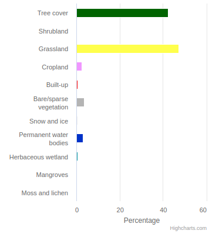

# 2021 landcover statistics

Computes landcover statistics over multiple user provided areas, based on the ESA WorldCover product.

As input, the service takes GeoJSON, which can also be a FeatureCollection defining multiple feature.

The output is a csv file containing the fraction of a specific landcover present in each area.

This service is maintained and provided by Terrascope.

## Methodology

The European Space Agency (ESA) WorldCover 10 m 2021 product provides a global land cover map for 2021 at 10 m resolution based on Sentinel-1 and Sentinel-2 data. The WorldCover product comes with 11 land cover classes, aligned with UN-FAO's Land Cover Classification System, and has been generated in the framework of the ESA WorldCover project.

## Performance

The cost of an example run using 3 medium sized areas spread across Europe was 6 platform credits, it finished in under 4 minutes total runtime.
Performance characteristics may differ depending on the type of polygon inputs, for instance, a single large area versus many small areas. Hence it 
is advised to perform tests based on your desired geometry.

