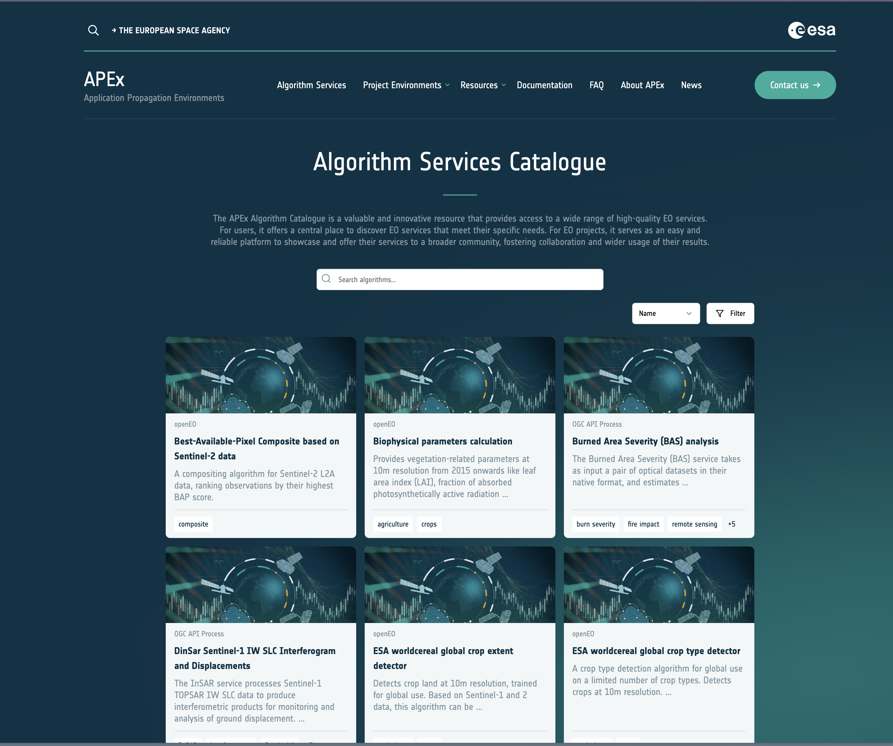

 The [APEx Algorithm Services Catalogue](https://algorithm-catalogue.apex.esa.int/) is a valuable and innovative resource that grants access to a wide array of high-quality EO services. It serves as a central hub for users to discover EO services tailored to their specific requirements. For EO projects, this catalogue provides an intuitive and reliable platform to showcase and offer their services to a broader community, thereby fostering collaboration and enhancing the utilization of their results.
 
All algorithms registered in this repository are seamlessly integrated and visualized within the APEx Algorithm Services Catalogue. This integration relies on properties defined in the OGC API Records stored in a JSON format. The information gleaned from the OGC API Records is instrumental in constructing both the overview of the catalogue and the detailed pages of each service.

{#fig-overview}

{#fig-details}

 
This page will delve deeper into the setup and operations of this integration, providing further insights into how users can benefit from the services offered.

# Record Mapping
The following sections demonstrate how the various sections from the record are connected to the information displayed in the APEx Algorithm Service Catalogue.

## Service Visibility

In those cases where the service is not intended to be publicly available, the `properties.visibility` property in the record can be set to `private`. This ensures that the service will not be listed in the [APEx Algorithm Services Catalogue](https://algorithm-catalogue.apex.esa.int/). The default value for this property is `public`, meaning that if it is not specified, the service will be visible in the catalogue.

## Services Overview

@tbl-overview-mapping illustrates how the various sections from the record are connected to the general overview of all the services in the APEx Service Catalogue as shown in @fig-overview.

| Component | Description | Record Property |
| :--- | :--- | :--- |
| Header | Header image of the service card | Entry in `properties.links` where `rel` is equal to `thumbnail`. If not available, a default image will be shown. |
| Type | Type of the service | Determined based on the value of the `confirmsTo` field. |
| Title | Title of the service card | `properties.title` |
| Description | Description of the service card | `properties.description` |
| Tags | Tags shown at the bottom of the service card | `properties.keywords` |
: APEx Algorithm Service Catalogue - Overview Mapping {#tbl-overview-mapping}

## Service Details

The following tables illustrate how the various sections from the record are connected to the service details page as shown in @fig-details.

### Main Content 

| Component | Description | Record Property |
| :--- | :--- | :--- |
| Type | Type of the service | Determined based on the value of the `confirmsTo` field. |
| Title | Title of the page | `properties.title` |
| Description | The full description of the service | If there is an entry in the `properties.links` section with `rel` equal to `application`, it will use this URL to fetch the description from the openEO UDP or CWL file. If the resource is protected or if it was not possible to fetch the information, this part will contain the value of `properties.description`. |
| Preview | Images shown as preview of the service | An image will be shown for each entry in the `properties.links` section where `rel` is set to `preview`. |
| Execution Information | Details for the execution of the service | This information is based on the `properties.links` where `rel` is equal to `service` or `application`. If the openEO UDP or CWL is publicly available, additional information will be fetched from its definition and automatically visualised in this section. |
| Contact | Contact information | `properties.contacts` |
: APEx Algorithm Service Catalogue - Details Main Content Mapping {#tbl-details-main-mapping}

### Sidebar

| Component | Description | Record Property |
| :--- | :--- | :--- |
| About | Short description of the service | `properties.description` |
| Cost estimation| Estimated execution cost of the service | The actual price is determined by `properties.cost_estimate` and the unit by `properties.cost_units` |
| Format | Supported output formats of the service | List of the `name` properties within the `properties.formats` array | 
| License | License linked to the usage of the service | `properties.license` | 
| Legal Agreement | Legal agreement linked to the usage of the service | Entry in the `properties.links` section where `rel` is set to `license`|
| Last Updated | Timestamp of the most recent service update | `properties.updates` | 
| Documentation | Button to redirect users to the service documentation | Entry in the `properties.links` section where `rel` is set to `about`|
| Code Repository | Button to redirect users to the service code repository | Entry in the `properties.links` section where `rel` is set to `code`|
| Request Access | Button to redirect users to the page to request access to the service | Entry in the `properties.links` section where `rel` is set to `order`|
| Execute Service | Button to redirect users to the page to execute the service | Entry in the `properties.links` section where `rel` is set to `webapp`|
: APEx Algorithm Service Catalogue - Details Main Content Mapping {#tbl-details-main-mapping}